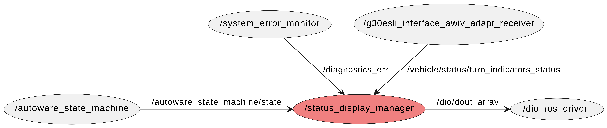

# Status display manager

## Overview
This node controls the display patterns of an electronic display board through `/dio_ros_driver` in order to alert pedestrians and vehicle drivers.

The display patterns of an electronic display board are defined as follows.

| Display patterns              | Description                                                                                                                      |
| :---------------------------- | :------------------------------------------------------------------------------------------------------------------------------- |
| Stop                          | The autonomous vehicle notifies the surrounding pedestrians and vehicle drivers that it is stopped in driving mode.              |
| Running                       | ⁠The autonomous vehicle notifies the surrounding pedestrians and vehicle drivers that it is in autonomous driving.                |
| Obstacle detection            | The autonomous vehicle notifies the surrounding pedestrians and vehicle drivers that it has stopped due to obstacle detection.   |
| Turn right                    | The autonomous vehicle notifies the surrounding pedestrians and vehicle drivers that it is turning right.                        |
| Turn left                     | The autonomous vehicle notifies the surrounding pedestrians and vehicle drivers that it is turning left.                         |
| Emergency occurred            | The autonomous vehicle notifies the surrounding pedestrians and vehicle drivers that a system error has occurred.                |
| Pressed emergency stop switch | The autonomous vehicle notifies the surrounding pedestrians and vehicle drivers that the emergency stop switch has been pressed. |
| Hidden                        | The autonomous vehicle notifies the surrounding pedestrians and vehicle drivers that it is in manual mode.                       |

## Display patterns

The combinations corresponding to the electronic display board status are as follows, and the corresponding DO port numbers can be found in the config file of `/dio_ros_driver`.

| Display patterns              | value0 | value1 | value2 |
| :---------------------------- | :----: | :----: | :----: |
| Stop                          |   0    |   0    |   0    |
| Running                       |   1    |   0    |   0    |
| Obstacle detection            |   0    |   1    |   0    |
| Turn right                    |   0    |   0    |   1    |
| Turn left                     |   1    |   0    |   1    |
| Emergency occurred            |   0    |   1    |   1    |
| Pressed emergency stop switch |   1    |   1    |   0    |
| Hidden                        |   1    |   1    |   1    |

## Input and Output
- input
    - `/autoware_state_machine/state` \[[autoware_state_machine_msgs/msg/StateMachine](https://github.com/eve-autonomy/autoware_state_machine_msgs/blob/main/msg/StateMachine.msg)\]: State of the system.
    - `/diagnostics_err` \[[diagnostic_msgs/msg/DiagnosticArray](https://github.com/ros/common_msgs/blob/noetic-devel/diagnostic_msgs/msg/DiagnosticArray.msg)\]: This message is used to send diagnostic information about the state of the robot.
     "status" parameter is an array of "diagnostic_msgs/msg/DiagnosticStatus", and among the elements, those whose "status.name" is "/autoware/vehicle/obstacle_crash" are the pressed state of the emergency stop switch.  If "status.level" is ERROR, it is pressed.
    - `/vehicle/status/turn_indicators_status` \[[autoware_auto_vehicle_msgs/msg/TurnIndicatorsReport](https://github.com/tier4/autoware_auto_msgs/blob/tier4/main/autoware_auto_vehicle_msgs/msg/TurnIndicatorsReport.idl)\]:  State of turn signal.
- output
    - `/dio/dout_array`  \[[dio_ros_driver/msg/DIOArray](https://github.com/kodamays/dio_ros_driver/blob/feat/dio_port_array_setting/msg/DIOArray.msg)\]: GPIO output topic for the display patterns of electronic display board.

## Node graph

## Sequence diagram

## Lanch arguments

| Name                       | Description                                                                                                                                             |
| :------------------------- | :------------------------------------------------------------------------------------------------------------------------------------------------------ |
| status_display_manager_config_path | Specify the config file path for `/dio_ros_driver` that designates the dout port number used for switching the display of the electronic display board. |

## Paramater description

| Name               | Description                                                                                   |
| :----------------- |:--------------------------------------------------------------------------------------------- |
| dout_ports_array | Specify the dout port numbers used for switching the display of the electronic display board.  Prohibited if no element is specified in [].|
| sleep_time_at_running_state | Specify Anti-flicker Sleep timer value for display while running. Default:500ms |